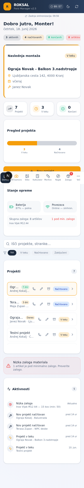
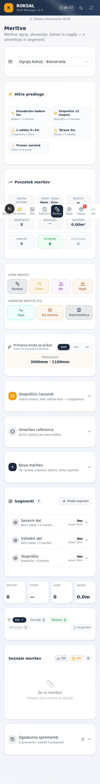
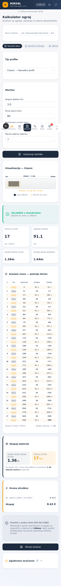
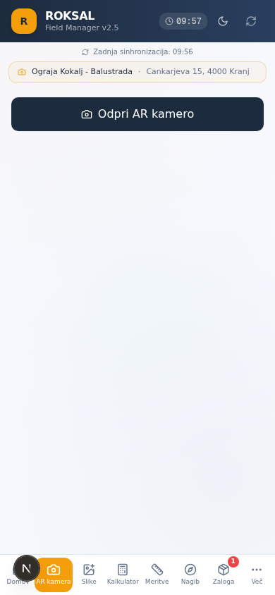
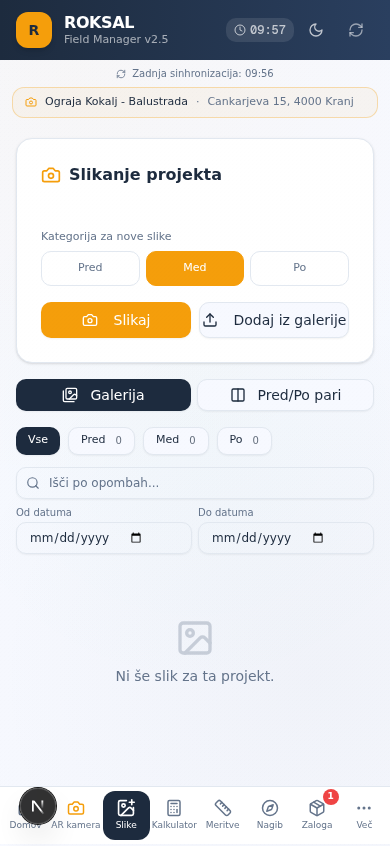

# 🏗️ Roksal Railing Manager

**Profesionalno orodje za monterje balkonskih in stopniščnih ograj**

[](https://nextjs.org/)
[](https://www.typescriptlang.org/)
[](https://www.prisma.io/)
[](https://tailwindcss.com/)
[](https://web.dev/progressive-web-apps/)
[](./LICENSE)

> Aplikacija za podjetje **Roksal d.o.o. Kranj** (izdelava in montaža alu/kovinskih/inox/WPC balkonskih in stopniščnih ograj po meri). Nadomešča ročne skice, papirne beležke in nepregledno dokumentacijo — od mere na terenu do arhivirane realizacije.

---

## 📑 Kazalo

- [Pregled](#-pregled)
- [Funkcije](#-funkcije)
- [Posnetki zaslona](#-posnetki-zaslona)
- [Tehnološki sklad](#-tehnološki-sklad)
- [Arhitektura](#-arhitektura)
- [Namestitev (lokalni razvoj)](#-namestitev-lokalni-razvoj)
- [Podatkovni model (Prisma)](#-podatkovni-model-prisma)
- [API končne točke](#-api-končne-točke)
- [Komponente](#-komponente)
- [Knjižnica izračunov](#-knjižnica-izračunov)
- [Uporaba](#-uporaba)
- [Deploy](#-deploy)
- [Diferenciacija od konkurence](#-diferenciacija-od-konkurence)
- [Varnost](#-varnost)
- [Licenca](#-licenca)

---

## 🎯 Pregled

**Roksal Railing Manager** je mobilna (PWA) aplikacija, zasnovana za monterje balkonskih ograj, ki delajo na terenu. Aplikacija pokriva celoten delovni tok — od mere na balkonu do arhivirane realizacije s PDF dokumentacijo.

### Ključne prednosti

- 📐 **AR vizualizacija ograj** — monter vidi ograjo v realnem času preko kamere, preden jo dejansko montira
- 🧮 **Profesionalni kalkulatorji** — razmik palic, kotni izračuni stopnic, skupni material, skladnost s predpisi
- 📏 **Specifične meritve za ograje** — stopniščni čarovnik, štebricki, WPC orientacije, koti
- 📷 **Dokumentacija s kamero** — slike pred/med/po montaži z annotacijami in GPS
- 📄 **PDF izvoz** — delovni list monterja, ponudba za stranko, materialni list
- 📴 **Deluje offline** — PWA s service workerjem, sinhronizacija ko je povezava

### Statistika projekta

| Metrika | Vrednost |
|---------|----------|
| Vrstic kode (src) | ~30.000 |
| React komponent | 14 glavnih + 60+ UI primitivov |
| API končne točke | 15 |
| Prisma modelov | 16 |
| Izračunske funkcije | 18 |
| Katalog profilov | 10 (WPC, ALU, Inox, Steklo) |
| Jezik vmesnika | Slovenščina |

---

## ✨ Funkcije

Aplikacija ima **8 glavnih zavihkov** + **6 podzavihkov** v meniju "Več".

### 🏠 1. Domov (Dashboard)

- Seznam projektov z iskalnikom in filtri (Vsi/V teku/Načrtovano/Zaključeni)
- Aktivni projekt z amber obrobo (klik za izbiro)
- Hitre akcije: Pokliči stranko, Uredi, Arhiviraj
- Statusni badge z relativnimi datumi (danes/včeraj/pred 3 dnevi)
- Povzetek: aktivni projekti, načrtovani, zaključeni, stanje zalog
- Nov projekt dialog (naziv, stranka, datum, opombe)

### 📷 2. AR kamera

Polnozaslonska AR vizualizacija ograj na balkonu:

- **Kamera zadaj** (`getUserMedia({facingMode:'environment'}})`) čez cel zaslon
- **Dodajanje točk** — tap na zaslon doda sidrno točko (stebriček) z zaporedno številko
- **Mikanje točk** — tap obstoječo točko jo izbriše; long-press za vleko
- **Vizualizacija ograje** — med točkami se izriše profil (prečke, palice, stebri) glede na izbran profil iz kataloga
- **Sprememba profila v realnem času** (WPC vodoravno, WPC pokončno, Inox, Steklo, ALU)
- **Kalibracija** — uporabnik vnese znano dolžino (npr. ploščica 600mm) → faktor px→mm
- **AR meritve** — dvotapni način: točka A, točka B → izračunana razdalja v mm/cm/m
- **Capture** — screenshot (video frame + canvas overlay) shrani v projekt
- **Zgodovina** — pregled shranjenih AR posnetkov za projekt

### 🖼️ 3. Slike

- **Kamera znotraj aplikacije** — `MediaDevices.getUserMedia` (ne sistem kamera)
- **Kategorije**: PRED / MED / PO montaži (barvno kodirani badge-i)
- **GPS lokacija** avtomatsko (geolocation API, high accuracy)
- **JPEG kompresija** — max 1280px širina, 0.75 quality (pred prevelikimi slikami)
- **Annotation editor** — 8 orodij (puščica, črta, pravokotnik, krog, besedilo, prostoro risanje, mera, radiraj), 5 barv, 3 debeline, native Canvas
- **Batch upload** iz galerije (multi-file, kompresija, GPS)
- **Pred/Po pari** z before/after sliderjem
- **Masonry layout** (CSS columns, responsive)
- **Filtri** — datumski range, search po opombah, kategorije
- **Enhanced preview** — navigacija prev/next, urejanje, izvoz, GPS link na Google Maps
- **Statistika** — št. slik po kategorijah, skupna velikost

### 🧮 4. Kalkulator

7 načinov izračuna + 6 izpolnitev:

| Način | Funkcija |
|-------|----------|
| **Razmak palic** | Equal spacing z SVG diagramom + pozicije od prve točke (drilling template) |
| **Kotni izračun** | Stopnišče/rake angle z diagramom |
| **Skupni material** | Multi-segment: palice + stebri + prečke + vijaki + sidra + cena |
| **Predpisi** | SIST EN: 110mm razmik, 900mm višina, 1500mm stebri, horizontal load |
| **Vetrna obremenitev** | Eurocode EN 1991-1-4 z regijami |
| **Kemično sidranje** | Prostornina smole, čas strjevanja, št. kartuš |
| **Railing spacing** | Osnovni razmik letev |

**Dodatne funkcije:**
- **Prihranjene predloge** — save/load konfiguracij z imenom
- **Strošek dela** — urna postavka × ur × monterjev + transport
- **Rezerva materiala** — 0/5/10/15/20% (privzeto 10%)
- **DDV ločeno** — 22% / 9.5% (gradnja) / 0%
- **Akontacija** — 0/30/50/70% z datumom plačila
- **Zgodovina izračunov** — timeline 30 zadnjih, klik = reload

### 📏 5. Meritve

Najobsežnejši modul (6390 vrstic):

#### Tipi meritev (9)
- `RAZDALJA` — razdalja med dvema točkama
- `VISINA` — višina od tal
- `KOT` — splošni kot
- `KOT_VOGAL` — notranji/zunanji vogal L-oblike (α = 180° − β)
- `KOT_STOPNISCE` — kot posamezne stopnice
- `NAGIB` — nagib tal/podkonstrukcije
- `GLOBINA` — globina (npr. vrtanja)
- `PREMER` — premer (npr. palice)
- `STEBR` — stebriček/paliza z avto-številko (S1, S2, S3...)
- `SEGMENT` — označitev odseka

#### Stopniščni čarovnik
- 4 vhodi (skupna višina, št. stopnic, globina, širina)
- Real-time izračun: višina posamezne stopnice, kot (atan), dolžina kosa (√), skupna dolžina
- Priporočilo barvno kodirano (30-35° zeleno / >37° oranžno / >40° rdeče)
- SVG diagram stopnišča z dimenzijami
- "Ustvari meritve" (5 tipov) + "Shrani kot predlogo"

#### WPC orientacije
3 novi segment tipi z avtomatskim izračunom števila palic:
- **WPC_POKOCNE** — navpične palice, razmak 110mm
- **WPC_VODORAVNE** — ležeče palice, razmak 110mm
- **WPC_POSEVNE** — palice pod kotom 45° (ali custom)
- SVG diagram orientation-specific
- "Dodaj WPC palice kot materiale" — kreira STEBR meritev za vsako (P1, P2...)

#### Ostale funkcije
- **Hitre predloge** — 4 template-i (balkon 3m, stopnišče, L-oblika, terasa 5m)
- **Multi-segment** — ravni/kotni/stopnišče/lokan z povzetki
- **Kalibracija reference** — A4 list, ploščica, znana dolžina → px/mm
- **Inline inclinometer** za kot/nagib (Device Orientation API)
- **Skupinske akcije** — checkbox mode, izberi več, izvozi/kopiraj/izbriši
- **Status meritev** — OSNUTEK/POTRJENA/ARHIVIRANA
- **Zgodovina sprememb** — audit trail (ADD/EDIT/DELETE/STATUS)
- **Glasovni vnos opomb** — Web Speech API (sl-SI)
- **Multi-unit prikaz** — 3000mm · 300cm · 3.00m
- **Vnos v katerikoli enoti** — Select mm/cm/m ob inputih
- **Povzetek projekta** — skupna dolžina, površina, št. segmentov
- **Izvoz CSV in PDF**

### 🧭 6. Nagib (Inclinometer)

- Digitalna libela z `deviceorientation` API
- Krožna libela z mehurčkom
- Prikaz kotov L↔D (levo-desno) in N↔Z (naprej-nazaj)
- iOS `requestPermission` podpora
- Shranjevanje nagiba v `/api/slopes` (kotStopinje, smer, lokacija)
- Zgodovina nagibov za projekt

### 📦 7. Zaloga (Inventory)

- Seznam materialov z low-stock badge v navigaciji
- Filter pills po kategorijah (WPC, Inox, Kemično, Aluminij)
- Mini stock chart z barvami (zelena OK, rdeča nizko)
- Premiki zaloge (dodaj/odvzemi)
- Poraba materiala na projekt

### ⋯ 8. Več (meni)

Sheet z 6 podzavihki:

#### 📄 Izvoz PDF
- **Delovni list monterja** — glava Roksal, podatki projekta, meritve, slike pred/med/po, opombe, podpisi
- **Ponudba za stranko** — postavke, DDV, skupaj, pogoji, podpis

#### 🖼️ Galerija realizacij
- Masonry layout (CSS columns, responsive)
- Lightbox s pred/po/drsnik + navigacija (←/→/ESC)
- Filtri (material pills, profil, lokacija, leto) + iskalnik
- PDF katalog realizacij (jsPDF, 2/stran, Roksal branding)
- Statistika + featured badge + sort opcije

#### 📚 Katalog profilov
- 10 Roksal profilov (WPC H-Line, V-Line, Panel, Steklo, Inox Line/Trosse, ALU Klasik/Modern, Steklo Full/Mini)
- Iskanje po nazivu/šifri/materialu
- Filtri po 10 kategorijah
- Vizualni preview profila (vodoravne/pokončne letve, steklo)
- RAL barvni indikator, cena €/m, dimenzije

#### ✏️ Skice
- Full-screen canvas z ročnim risanjem
- 3 načini (Pogled/Risanje/Mera)
- 6 barv, slider debeline
- Undo/clear
- Save/load/delete preko `/api/sketches`

#### 📋 Dokumenti
- Tehnični listi, primopredaja, e-računi, zapisniki

#### 🛡️ Varnost
- 8-točkovni kontrolni seznam
- SVG vetrni kompas
- Temperaturni indikator z digitalno termometrom
- Ghost Mode toggle

---

## 📸 Posnetki zaslona


*Domov — dashboard s projekti*


*Meritve — stopniščni čarovnik, segmenti, hitre predloge*


*Kalkulator — razmak palic z SVG diagramom*


*AR kamera — vizualizacija ograje na balkonu*


*Slike — kategorije pred/med/po, masonry*

---

## 🛠️ Tehnološki sklad

| Plast | Tehnologija |
|-------|-------------|
| **Ogrodje** | [Next.js 16](https://nextjs.org/) (App Router, Turbopack) |
| **Jezik** | [TypeScript 5](https://www.typescriptlang.org/) (strict) |
| **Stil** | [Tailwind CSS 4](https://tailwindcss.com/) + [shadcn/ui](https://ui.shadcn.com/) (New York) |
| **Ikone** | [Lucide React](https://lucide.dev/) |
| **Baza** | [Prisma ORM 6](https://www.prisma.io/) + SQLite |
| **Avtentikacija** | [NextAuth.js v4](https://next-auth.js.org/) (na voljo) |
| **Stanje** | React hooks (Zustand na voljo) + TanStack Query |
| **Kamera/AR** | MediaDevices API + Canvas 2D + WebXR (kjer podprt) |
| **Nagib** | Device Orientation API |
| **Skice** | HTML5 Canvas z ročnim risanjem |
| **Glas** | Web Speech API (sl-SI) |
| **PDF** | [jsPDF](https://github.com/parallax/jsPDF) + jspdf-autotable |
| **PWA** | Service Worker + Web Manifest |
| **Temnitveni način** | [next-themes](https://github.com/pacocoursey/next-themes) |
| **Validacija** | [Zod 4](https://zod.dev/) |
| **Paketni upravitelj** | [Bun](https://bun.sh/) |
| **Linting** | ESLint 9 + eslint-config-next |

---

## 🏛️ Arhitektura

```
roksal-railing-manager/
├── prisma/
│   ├── schema.prisma          # 16 modelov (SQLite)
│   └── seed.ts                # Demo podatki (profili, stranke, projekti)
├── src/
│   ├── app/
│   │   ├── layout.tsx         # Metadata, ThemeProvider, SW registracija
│   │   ├── page.tsx           # Glavna SPA (8 zavihkov + Več meni)
│   │   ├── globals.css        # Roksal tema (navy/amber)
│   │   └── api/               # 15 API končnih točk (Route Handlers)
│   │       ├── ar-snapshots/
│   │       ├── auth/
│   │       ├── calculator/
│   │       ├── documents/
│   │       ├── gallery/
│   │       ├── inventory/
│   │       ├── measurements/
│   │       ├── photos/
│   │       ├── profili/
│   │       ├── projects/
│   │       ├── sketches/
│   │       ├── slopes/
│   │       ├── sync/
│   │       └── weather/
│   ├── components/
│   │   ├── ui/                # shadcn/ui primitivi (60+)
│   │   └── roksal/            # 14 glavnih komponent (glej spodaj)
│   ├── lib/
│   │   ├── calculator.ts      # 18 izračunskih funkcij
│   │   ├── db.ts              # Prisma Client
│   │   ├── ral-colors.ts      # 26 RAL barv
│   │   ├── roksal-catalog-data.ts  # WPC profili, cene, specifikacije
│   │   ├── validations.ts     # Zod sheme
│   │   └── wind-service.ts    # Vetrni podatki (OpenWeather)
│   └── hooks/
│       ├── use-toast.ts
│       └── use-mobile.ts
├── public/
│   ├── manifest.json          # PWA manifest
│   ├── sw.js                  # Service Worker (offline cache)
│   ├── icon.svg / icon-192.png / icon-512.png
│   └── logo.svg
├── docs/screenshots/          # Slike za README
└── package.json
```

### Vloge uporabnikov (Prisma `Profile`)

- `ADMIN` — polni dostop, ureja cenik, katalog, vse projekte
- `VODJA` — vodi ekipo, dodeljuje projekte
- `MONTER` — vidi svoje projekte, ustvarja/ureja meritve, skice, slike
- `SKLADISCE` — upravlja zalogo

---

## 🚀 Namestitev (lokalni razvoj)

### Zahteve

- [Node.js](https://nodejs.org/) 20+ ali [Bun](https://bun.sh/) 1.1+
- Git

### Koraki

```bash
# 1. Kloniraj repo
git clone https://github.com/markec12345678/Roksal-Railing-Manager.git
cd Roksal-Railing-Manager

# 2. Namesti odvisnosti
bun install

# 3. Pripravi okoljske spremenljivke
cp .env.example .env  # ustvari .env z DATABASE_URL=file:./db/custom.db

# 4. Inicializiraj bazo
bun run db:push        # sinhroniziraj Prisma shemo
bunx tsx prisma/seed.ts # sejaj demo podatke (10 profilov, 3 stranke, 4 projekti)

# 5. Zaženi razvojni server
bun run dev
# → http://localhost:3000
```

### Skripte

| Skripta | Opis |
|---------|------|
| `bun run dev` | Zažene Next.js dev server (port 3000) |
| `bun run build` | Produkcijska build |
| `bun run start` | Zažene produkcijski server |
| `bun run lint` | ESLint preverjanje |
| `bun run db:push` | Sinhronizira Prisma shemo z bazo |
| `bun run db:generate` | Generira Prisma Client |
| `bun run db:migrate` | Ustvari migracijo |
| `bun run db:reset` | Ponastavi bazo |

### Privzeti uporabniki (po seed-u)

| Email | Vloga |
|-------|-------|
| `marko@roksal.si` | MONTER |
| `admin@roksal.si` | ADMIN |
| `peter@roksal.si` | MONTER |

---

## 🗄️ Podatkovni model (Prisma)

16 modelov v SQLite:

| Model | Namen |
|-------|-------|
| `Profile` | Uporabniki z vlogami (ADMIN/VODJA/MONTER/SKLADISCE) |
| `Customer` | Stranke (ime, naslov, telefon, email) |
| `Project` | Projekti (status: NACRTOVANO/V_TEKU/ZAKLJUCENO/USTAVLJENO) |
| `Measurement` |Meritve (dolzinaMm, visinaMm, arMetadata JSON) |
| `Inventory` | Materialna zaloga (sifra, kolicina, minimalnaZaloga) |
| `MaterialUsage` | Poraba materiala na projektu |
| `InventoryMovement` | Premiki zaloge |
| `Document` | Dokumenti (PDF, podpisi) |
| `AuditLog` | Sledenje sprememb |
| `Notification` | Obvestila uporabnikom |
| `Profil` | Katalog profilov ograj (10 sejanih) |
| `ArSnapshot` | AR posnetki (imageUrl, tocke, meritve, kalibracija) |
| `Sketch` | Skice (PNG base64) |
| `GalleryItem` | Galerija realizacij (pred/po, javno/privatno) |
| `Slope` |Meritve nagibov (kotStopinje, smer, lokacija) |
| `ProjectPhoto` | Slike projektov (PRED/MED/PO, GPS) |

---

## 🔌 API končne točke

15 Route Handlerjev (Next.js App Router):

| Končna točka | Metode | Namen |
|--------------|--------|-------|
| `/api/projects` | GET, POST, PATCH | Projekti s strankami, meritvami, materiali |
| `/api/measurements` | GET, POST |Meritve z AR metapodatki |
| `/api/photos` | GET, POST, DELETE | Slike pred/med/po z GPS |
| `/api/ar-snapshots` | GET, POST, DELETE | AR posnetki s točkami |
| `/api/sketches` | GET, POST, DELETE | Skice (PNG base64) |
| `/api/slopes` | GET, POST | Nagibi |
| `/api/profili` | GET, POST | Katalog profilov |
| `/api/gallery` | GET, POST | Galerija realizacij |
| `/api/inventory` | GET, POST | Zaloga + premiki |
| `/api/documents` | GET, POST | Dokumenti |
| `/api/calculator` | POST | Izračuni (razmak, sidranje, veter) |
| `/api/weather` | GET | Vetrni podatki (OpenWeather) |
| `/api/auth` | GET, POST | Enostavna avtentikacija |
| `/api/sync` | GET, POST | Sinhronizacija z mobilno aplikacijo |
| `/api/route.ts` | GET | Health check |

---

## 🧩 Komponente

14 glavnih komponent v `src/components/roksal/`:

| Komponenta | Vrstice | Funkcija |
|-----------|---------|----------|
| `measurements-tab.tsx` | 6390 |Meritve (9 tipov, stopniščni čarovnik, WPC, štebricki) |
| `calculator-tab.tsx` | 4159 | Kalkulator (7 načinov + 6 izpolnitev) |
| `reference-gallery.tsx` | 1875 | Galerija z masonry, lightbox, PDF katalog |
| `photo-tab.tsx` | 1835 | Slike z annotation editor, batch, pred/po |
| `ar-scanner.tsx` | 1706 | AR kamera z vizualizacijo ograje |
| `dashboard-tab.tsx` | 1274 | Domov s projekti, iskalnikom, filtri |
| `sketch-canvas.tsx` | 933 | Skicirka z ročnim risanjem |
| `inventory-tab.tsx` | 709 | Zaloga z mini stock chart |
| `safety-tab.tsx` | 683 | Varnost: kontrolni seznam, kompas, termometer |
| `documents-tab.tsx` | 560 | Dokumenti |
| `pdf-export.tsx` | 452 | PDF delovni list + ponudba |
| `inclinometer-tab.tsx` | 275 | Digitalna libela |
| `roksal-catalog.tsx` | 230 | Katalog profilov z iskanjem |
| `ral-color-picker.tsx` | 219 | RAL barvnik (26 barv) |

---

## 🧮 Knjižnica izračunov

18 funkcij v `src/lib/calculator.ts`:

### Osnovni (originalni)
- `calculateRailingSpacing(input)` — razmik letev WPC
- `calculateAnchoring(input)` — kemično sidranje (prostornina, čas strjevanja)
- `calculateWindLoad(input)` — vetrna obremenitev (Eurocode EN 1991-1-4)

### Razširjeni (P2)
- `calculateEqualSpacing(input)` — enakomeren razmak palic + pozicije
- `calculateAngledSpacing(input)` — kotni/stopniški izračun
- `calculateHoleTemplate(input)` — predloga za vrtanje (running measurements)
- `calculateMaterialTotal(input)` — skupni material (multi-segment)
- `checkCompliance(input)` — skladnost s predpisi (SIST EN)

### Pomožni (P2)
- `formatEUR(eur)` — slovenski format valute (1.234,56 €)
- `formatSI(num)` — slovenski format števil
- `calculateLaborCost(input)` — strošek dela
- `applyReserve(qty, pct)` — rezerva materiala
- `calculateDDV(amount, rate)` — DDV
- `calculateAkontacija(total, pct)` — akontacija + preostanek

---

## 📱 Uporaba

### Glavni delovni tok monterja

1. **Na terenu** → odpri aplikacijo na telefonu (PWA)
2. **Domov** → izberi projekt (ali ustvari nov)
3. **Meritve** → uporabi stopniščni čarovnik ali hitro predlogo, dodaj meritve z glasom
4. **AR kamera** → vizualiziraj ograjo na balkonu, shrani posnetek
5. **Slike** → fotografiraj pred montažo, dodaj annotacije
6. **Kalkulator** → izračunaj razmik palic, material, ceno
7. **Nagib** → preveri vodoravnost tal
8. **Več → Izvoz PDF** → generiraj delovni list za monterja + ponudbo za stranko

### Namestitev kot PWA na telefon

1. Odpri aplikacijo v mobilnem brskalniku (Chrome/Safari)
2. Meni → **"Dodaj na domači zaslon"**
3. Aplikacija se odpre v fullscreen načinu z ikono Roksal

### Offline delovanje

- Service Worker cache-a statične resurse in navigacije
- API zahteve gredo preko omrežja (network-first), fallback na cache
- Ko povezava ni na voljo, meritve/slike ostanejo v lokalnem stanju in se sinhronizirajo ko povezava vrne

---

## 🚢 Deploy

### Produkcija (samostojno)

```bash
bun run build
bun run start
```

### Z Dockerjem (priporočeno)

```dockerfile
FROM oven/bun:1 AS base
WORKDIR /app
COPY package.json bun.lock ./
RUN bun install --frozen-lockfile --production
COPY . .
RUN bun run db:push
RUN bun run build
EXPOSE 3000
CMD ["bun", "run", "start"]
```

### Environment spremenljivke

| Spremenljivka | Opis | Privzeto |
|---------------|------|----------|
| `DATABASE_URL` | Pot do SQLite datoteke | `file:./db/custom.db` |
| `NEXTAUTH_SECRET` | Skrivni ključ za NextAuth | (generiraj) |
| `NEXTAUTH_URL` | URL aplikacije | `http://localhost:3000` |
| `OPENWEATHER_API_KEY` | API ključ za vetrne podatke | (opcijsko) |

---

## 🆚 Diferenciacija od konkurence

### Najbližji konkurenti

| Funkcija | AR Railing (Devden) | Baluster Calculator | AR Ruler | Joist | **Roksal** |
|----------|:-------------------:|:-------------------:|:--------:|:-----:|:----------:|
| AR vizualizacija ograj | ✅ | — | — | — | ✅ |
| Dodajanje/mikanje točk | ✅ | — | — | — | ✅ |
| AR meritve razdalj | — | — | ✅ | — | ✅ |
| Stopniščni čarovnik | — | — | — | — | ✅ |
| Štebricki z oštevilčenjem | — | — | — | — | ✅ |
| WPC orientacije (pokončne/vodoravne/poševne) | — | — | — | — | ✅ |
| Kalkulator materiala | — | delno | — | — | ✅ |
| Skladnost s predpisi (SIST EN) | — | — | — | — | ✅ |
| Slikanje z annotacijami | — | — | — | — | ✅ |
| Pred/po pari | — | — | — | — | ✅ |
| PDF delovni list + ponudba | — | — | — | delno | ✅ |
| Galerija realizacij | — | — | — | — | ✅ |
| Katalog profilov po meri | — | — | — | — | ✅ |
| Nagib/libela | — | — | — | — | ✅ |
| Glasovni vnos | — | — | — | — | ✅ |
| PWA offline | — | — | — | — | ✅ |
| Namensko za Roksal Kranj | — | — | — | — | ✅ |

**Zaključek:** AR Railing je potrošniška aplikacija za lastnike stanovanj; Roksal Railing Manager je **profesionalno orodje za monterja** s celovitim delovnim tokom.

---

## 🔒 Varnost

### Avtentikacija

- NextAuth.js v4 (na voljo, trenutno enostavna API-key avtentikacija)
- Vloge: ADMIN, VODJA, MONTER, SKLADISCE
- Audit log vseh sprememb (kdaj, kdo, stara/nova vrednost)

### Podatki

- Baza: SQLite (lokalna datoteka, prenosljiva)
- Gesla: bcrypt hash (če je NextAuth aktiviran)
- Slike: base64 v bazi (za prenosljivost) ali filesystem (opcijsko)
- GPS: samo ob eksplicitni uporabnikovi privolitvi

### HTTPS obvezno

Aplikacija uporablja:
- Kamera (`getUserMedia`) — zahteva HTTPS
- Device Orientation (iOS) — zahteva HTTPS + gesto
- Geolocation — zahteva HTTPS
- Service Worker — zahteva HTTPS

---

## 📄 Licenca

**Proprietary** — lastništvo Roksal d.o.o. Kranj.

Vse pravice pridržane. Nedovoljena uporaba, kopiranje ali distribucija brez pisnega dovoljenja Roksal d.o.o. je prepovedana.

© 2024–2025 Roksal d.o.o., Kranj, Slovenija.

---

## 📞 Kontakt

**Roksal d.o.o. Kranj**
- Spletna stran: [roksal.si](https://roksal.si) (opcijsko)
- Email: info@roksal.si
- Telefon: +386 4 XX XX XXX

---

## 🙏 Zahvale

- [Next.js](https://nextjs.org/) — ogrodje
- [Prisma](https://www.prisma.io/) — ORM
- [shadcn/ui](https://ui.shadcn.com/) — UI komponente
- [Tailwind CSS](https://tailwindcss.com/) — stil
- [Lucide](https://lucide.dev/) — ikone
- [jsPDF](https://github.com/parallax/jsPDF) — PDF generacija

---

**Razvito s ❤️ za monterje balkonskih ograj.**
